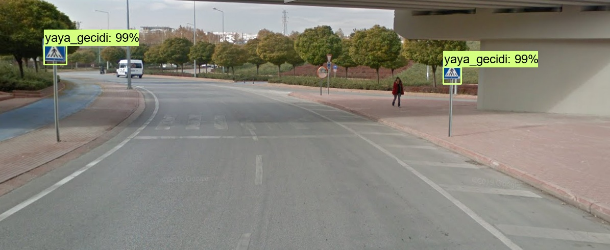

[](https://github.com/zekeriyafince/EyePair/blob/master/LICENSE)

# TurkishTrafficSignDetection
 Detecting the Turkish Traffic Sign with Faster R-CNN

## Requirements

- [Anaconda / Python 3.7](https://www.anaconda.com/download)
- [Tensorflow](http://www.tensorflow.org)
- [OpenCV 3.4](http://opencv.org/)

## How to Run
Default images file "test_images/*.jpg"
```python
python3 sign_detection_image.py
```

## Result


  
